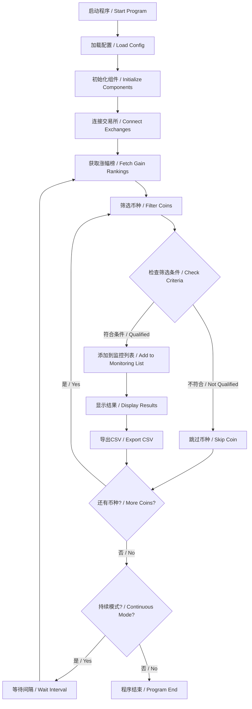

# 暴涨币种筛选器 / Surging Coin Screener

[](https://python.org)
[](LICENSE)
[]()

## 项目简介 / Project Overview

**暴涨币种筛选器**是一个专门从真实市场筛选暴涨加密货币的智能化工具。系统通过连接主流交易所API，实时监控涨幅榜单，智能筛选符合条件的暴涨币种，为量化交易提供高质量的信号源。

**Surging Coin Screener** is an intelligent tool specifically designed to screen surging cryptocurrencies from real markets. The system connects to mainstream exchange APIs, monitors gain rankings in real-time, intelligently filters qualifying surging coins, and provides high-quality signal sources for quantitative trading.

## 核心功能 / Core Features

### 🎯 智能筛选条件 / Intelligent Screening Criteria
- **涨幅榜前10** / Top 10 in gain rankings
- **单边上涨行情** / Unilateral uptrend market
- **X天涨幅>80%** / X-day gain > 80% (X ≤ 6 days)
- **实时监控更新** / Real-time monitoring updates

### 📊 多交易所支持 / Multi-Exchange Support  
- **Bitget** - 主要数据源 / Primary data source
- **币安 Binance** - 预留接口 / Reserved interface
- **欧易 OKX** - 预留接口 / Reserved interface

### 📈 输出功能 / Output Features
- **控制台实时显示** / Real-time console display
- **CSV名单导出** / CSV list export
- **持续监控模式** / Continuous monitoring mode
- **历史数据记录** / Historical data recording

## 快速开始 / Quick Start

### 1. 环境要求 / Requirements
```bash
Python 3.8+
pip (Python包管理器 / Python package manager)
```

### 2. 安装依赖 / Install Dependencies
```bash
# 克隆项目 / Clone project
git clone <repository-url>
cd Quantitative-Trading

# 安装依赖包 / Install dependencies
pip install -r requirements.txt
```

### 3. 配置API密钥 / Configure API Keys

#### 🔐 创建 .env 文件 / Create .env File
```bash
# 复制示例文件 / Copy example file  
cp .env.example .env

# 编辑 .env 文件，填入您的API密钥 / Edit .env file and fill in your API keys
notepad .env  # Windows
nano .env     # Linux/Mac
```

#### 🔑 配置Bitget API密钥 / Configure Bitget API Keys
在 `.env` 文件中填入您的Bitget API信息：
Fill in your Bitget API information in the `.env` file:

```env
# Bitget交易所API配置 / Bitget Exchange API Configuration
BITGET_API_KEY=your_bitget_api_key_here
BITGET_SECRET_KEY=your_bitget_secret_key_here  
BITGET_PASSPHRASE=your_bitget_passphrase_here

# 其他交易所（可选）/ Other Exchanges (Optional)
BINANCE_API_KEY=your_binance_api_key_here
BINANCE_SECRET_KEY=your_binance_secret_key_here

# 代理配置（中国用户必需）/ Proxy Configuration (Required for China users)
USE_PROXY=true
PROXY_HOST=127.0.0.1
PROXY_PORT=10808         # 代理端口 / Proxy port
PROXY_PROTOCOL=socks5    # 或 http，取决于端口类型 / or http, depends on port type
```

#### 📋 获取API密钥步骤 / Steps to Get API Keys
1. **访问Bitget官网** / Visit Bitget Official Website
   - 🌐 [https://www.bitget.com](https://www.bitget.com)
   - 注册并完成身份验证 / Register and complete identity verification

2. **创建API密钥** / Create API Key
   - 登录后进入 **API管理** 页面 / After login, go to **API Management** page
   - 点击 **创建API** / Click **Create API**
   - 设置API权限（建议仅开启读取权限）/ Set API permissions (recommend read-only)

3. **复制密钥信息** / Copy Key Information
   - 📋 复制 `API Key`、`Secret Key` 和 `Passphrase`
   - 🔒 粘贴到 `.env` 文件中对应位置

#### 🌐 代理配置（中国用户）/ Proxy Configuration (China Users)
如果您在中国大陆，需要配置代理才能访问外网API：
If you are in mainland China, you need to configure a proxy to access foreign APIs:

```env
# 代理配置 / Proxy Configuration
USE_PROXY=true
PROXY_HOST=127.0.0.1        # 代理服务器地址 / Proxy server address
PROXY_PORT=10808            # 代理端口 / Proxy port
PROXY_PROTOCOL=socks5       # 代理协议：socks5 或 http / Proxy protocol: socks5 or http
```

**📋 常见代理设置 / Common Proxy Settings:**
- **V2Ray/Xray**: 通常使用 `socks5://127.0.0.1:10808`
- **Clash**: 通常使用 `http://127.0.0.1:7890` 或 `socks5://127.0.0.1:7891`
- **Shadowsocks**: 通常使用 `socks5://127.0.0.1:1080`

**⚠️ 安全提醒 / Security Warning:**
- `.env` 文件包含敏感信息，请勿分享或提交到版本控制
- The `.env` file contains sensitive information, do not share or commit to version control
- 建议仅开启读取权限，无需交易权限 / Recommend read-only permissions, no trading permissions needed
- 代理配置仅在本地使用，不会泄露到网络 / Proxy configuration is only used locally, not leaked to network

#### ⚙️ 配置文件说明 / Configuration File Description
系统配置文件 `config/scanner.yaml` 已自动配置为从环境变量读取API密钥：
The system configuration file `config/scanner.yaml` is automatically configured to read API keys from environment variables:

```yaml
# 筛选条件配置 / Screening Criteria Configuration
screening:
  top_rank_limit: 10        # 涨幅榜前N名 / Top N in gain ranking
  min_gain_percent: 80.0    # 最小涨幅百分比 / Minimum gain percentage  
  max_gain_days: 6          # 最大涨幅天数 / Maximum gain days

# 交易所配置 / Exchange Configuration  
exchanges:
  bitget:
    enabled: true           # 启用Bitget / Enable Bitget
    use_env: true          # 使用环境变量 / Use environment variables
    api_key_env: "BITGET_API_KEY"        # API密钥环境变量名
    secret_key_env: "BITGET_SECRET_KEY"  # 密钥环境变量名
    passphrase_env: "BITGET_PASSPHRASE"  # 口令环境变量名
```

### 4. 运行筛选器 / Run Screener

#### 单次扫描模式 / Single Scan Mode
```bash
# 执行一次完整的市场扫描 / Execute one complete market scan
python main.py
```

#### 持续监控模式 / Continuous Monitoring Mode
```bash
# 每30分钟自动扫描一次 / Auto scan every 30 minutes
python main.py --continuous
```

## 使用示例 / Usage Examples

### 筛选结果示例 / Screening Results Example
```
🚀 开始执行暴涨币种筛选 / Starting surging coin screening 🚀
================================================================

📊 正在获取涨幅榜前10名... / Fetching top 10 gainers...
✅ 成功获取10个币种数据 / Successfully fetched 10 coin data

🔍 [1/10] 分析币种: PEPE/USDT (24h涨幅: 156.78%)
✅ PEPE/USDT 符合条件！3天涨幅187.65%

🔍 [2/10] 分析币种: SHIB/USDT (24h涨幅: 134.56%)
✅ SHIB/USDT 符合条件！4天涨幅156.43%

================================================================
🎯 筛选完成！共找到 2 个暴涨币种 / Screening completed! Found 2 surging coins
================================================================

📋 符合条件的暴涨币种名单 / List of qualifying surging coins:
--------------------------------------------------------------------------------
 1. PEPE/USDT        | 排名:  1 | 当前价格: $0.000012  | 24h涨幅: 156.78% | 3天涨幅: 187.65%
    PEPE/USDT        | Rank:  1 | Price: $0.000012    | 24h: 156.78%     | 3d gain: 187.65%
 2. SHIB/USDT        | 排名:  2 | 当前价格: $0.000023  | 24h涨幅: 134.56% | 4天涨幅: 156.43%
    SHIB/USDT        | Rank:  2 | Price: $0.000023    | 24h: 134.56%     | 4d gain: 156.43%
--------------------------------------------------------------------------------

📄 筛选结果已导出: results/surging_coins_20241220_143022.csv
```

### 导出文件示例 / Export File Example
筛选结果会自动导出为CSV文件，包含以下信息：
Screening results are automatically exported as CSV files containing:

| 序号/No. | 币种符号/Symbol | 涨幅榜排名/Rank | 当前价格/Price | 24h涨幅%/24h Gain% | 最大涨幅天数/Max Days | 最大涨幅%/Max Gain% |
|---------|----------------|----------------|---------------|--------------------|---------------------|-------------------|
| 1       | PEPE/USDT      | 1              | 0.000012      | 156.78             | 3                   | 187.65            |
| 2       | SHIB/USDT      | 2              | 0.000023      | 134.56             | 4                   | 156.43            |

## 系统架构 / System Architecture



## 项目结构 / Project Structure

```
Quantitative Trading/
├── main.py                    # 主程序入口 / Main program entry
├── config/
│   └── scanner.yaml          # 扫描器配置文件 / Scanner configuration
├── core/
│   └── market_scanner.py     # 市场扫描器核心逻辑 / Market scanner core logic
├── utils/
│   ├── exchange_client.py    # 交易所API客户端 / Exchange API client
│   └── helpers.py           # 工具函数库 / Utility functions
├── results/                 # 筛选结果输出目录 / Screening results output
├── logs/                   # 日志文件目录 / Log files directory
├── requirements.txt        # 项目依赖包 / Project dependencies
└── README.md              # 项目说明文档 / Project documentation
```

## 配置说明 / Configuration Guide

### 筛选条件配置 / Screening Criteria Configuration
```yaml
screening:
  top_rank_limit: 10        # 涨幅榜前N名 / Top N in gain ranking
  min_gain_percent: 80.0    # 最小涨幅百分比 / Minimum gain percentage  
  max_gain_days: 6          # 最大涨幅天数 / Maximum gain days
  min_volume_24h: 100000    # 最小24小时交易量 / Minimum 24h volume
  trend_check_days: 3       # 单边上涨检查天数 / Unilateral uptrend check days
```

### 扫描配置 / Scanning Configuration
```yaml
scanning:
  interval_minutes: 30      # 扫描间隔（分钟）/ Scanning interval (minutes)
  auto_update: true         # 是否自动更新 / Whether to auto update
  max_coins_monitor: 50     # 最大监控币种数量 / Maximum monitored coins count
```

### 输出配置 / Output Configuration
```yaml
output:
  console_display: true     # 控制台显示 / Console display
  export_csv: true          # 导出CSV文件 / Export CSV file
  results_directory: "results"  # 结果目录 / Results directory
```

## 高级功能 / Advanced Features

### 1. 风险控制 / Risk Control
- **黑名单过滤** / Blacklist filtering
- **白名单模式** / Whitelist mode
- **最小市值要求** / Minimum market cap requirement

### 2. 通知功能（预留）/ Notification Features (Reserved)
- **Webhook通知** / Webhook notifications
- **邮件提醒** / Email alerts
- **实时推送** / Real-time push

### 3. 数据存储 / Data Storage
- **历史数据记录** / Historical data recording
- **筛选结果归档** / Screening results archiving
- **统计分析报告** / Statistical analysis reports

## 常见问题 / FAQ

### Q: 如何添加新的交易所？ / How to add new exchanges?
A: 在 `utils/exchange_client.py` 中添加新的交易所客户端类，并在配置文件中启用。
Add a new exchange client class in `utils/exchange_client.py` and enable it in the configuration file.

### Q: 可以自定义筛选条件吗？ / Can I customize screening criteria?
A: 是的，修改 `config/scanner.yaml` 中的筛选参数即可。
Yes, modify the screening parameters in `config/scanner.yaml`.

### Q: 如何处理API限制？ / How to handle API limits?
A: 系统内置了请求频率控制，可以在配置文件中调整扫描间隔。
The system has built-in request rate limiting, you can adjust the scanning interval in the configuration file.

### Q: 筛选结果保存在哪里？ / Where are screening results saved?
A: 默认保存在 `results/` 目录下，文件名包含时间戳。
By default saved in the `results/` directory with timestamp in filename.

## 技术支持 / Technical Support

- **问题反馈** / Issue Reports: [GitHub Issues](https://github.com/your-repo/issues)
- **功能建议** / Feature Requests: [GitHub Discussions](https://github.com/your-repo/discussions)
- **文档更新** / Documentation Updates: [Wiki](https://github.com/your-repo/wiki)

## 版本历史 / Version History

### v1.0.0 (2024-12-20)
- ✅ 实现基本的币种筛选功能 / Basic coin screening functionality
- ✅ 支持Bitget交易所 / Bitget exchange support
- ✅ CSV结果导出 / CSV result export
- ✅ 持续监控模式 / Continuous monitoring mode
- ✅ 完整的中英文双语支持 / Complete bilingual support

## 许可证 / License

本项目采用 MIT 许可证 - 详情请见 [LICENSE](LICENSE) 文件。
This project is licensed under the MIT License - see the [LICENSE](LICENSE) file for details.

## 贡献指南 / Contributing

欢迎贡献代码和建议！请查看 [CONTRIBUTING.md](CONTRIBUTING.md) 了解详细信息。
Contributions are welcome! Please see [CONTRIBUTING.md](CONTRIBUTING.md) for details.

---

**⚠️ 风险提示 / Risk Warning**

本工具仅用于信息筛选和分析，不构成投资建议。加密货币交易存在高风险，请谨慎投资。
This tool is for information screening and analysis only and does not constitute investment advice. Cryptocurrency trading involves high risks, please invest carefully. 