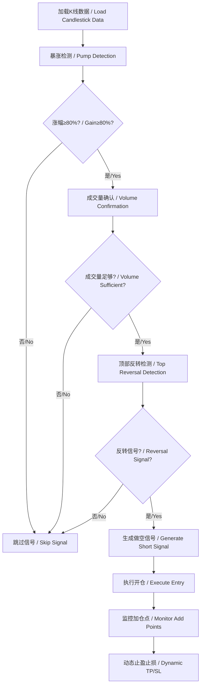

# 暴涨做空策略系统 / Pump Short Strategy System

## 🎯 项目简介 / Project Overview

**暴涨做空策略系统**是一个专为识别加密货币（特别是Meme币）暴涨后做空时机而设计的量化交易策略模拟系统。该系统能够自动检测价格异常暴涨信号，并在合适时机执行做空策略，通过反向网格加仓、智能止盈止损等机制实现盈利。

**Pump Short Strategy System** is a quantitative trading strategy simulation system designed specifically to identify short-selling opportunities after cryptocurrency (especially Meme coins) pump events. The system automatically detects abnormal price surge signals and executes short strategies at appropriate timing, achieving profits through reverse grid position adding, intelligent take profit and stop loss mechanisms.

## ✨ 核心特性 / Core Features

### 🧠 策略核心逻辑 / Strategy Core Logic

1. **暴涨识别 / Pump Detection**
   - 3天内涨幅≥80%的标的筛选 / Screen assets with ≥80% gain in 3 days
   - 成交量确认防止假突破 / Volume confirmation to prevent false breakouts
   - 反泡沫过滤机制 / Anti-bubble filtering mechanism

2. **顶部反转信号 / Top Reversal Signals**
   - 放量阴线检测 / Volume bearish candle detection
   - 上影线分析 / Upper shadow analysis
   - 十字星形态识别 / Doji pattern recognition

3. **反向网格加仓 / Reverse Grid Position Adding**
   - 每上涨10%加空一次 / Add short position every 10% rise
   - 每下跌6.5%加空一次 / Add short position every 6.5% decline
   - 最多各加仓3次 / Maximum 3 times each direction

4. **智能止盈止损 / Intelligent Take Profit & Stop Loss**
   - 止损：价格超过建仓价35% / Stop loss: price exceeds entry by 35%
   - 止盈：平均持仓盈利12% / Take profit: average position profit 12%
   - 动态风险管理 / Dynamic risk management

### 🏗️ 系统架构 / System Architecture

```
quant-short-strategy/
├── strategies/                 # 策略模块 / Strategy modules
│   └── pump_short_strategy.py # 核心策略逻辑 / Core strategy logic
├── core/                      # 核心组件 / Core components
│   ├── position.py           # 持仓管理 / Position management
│   ├── portfolio.py          # 投资组合管理 / Portfolio management
│   └── executor.py           # 交易执行器 / Trade executor
├── utils/                     # 工具模块 / Utility modules
│   └── helpers.py            # 辅助函数 / Helper functions
├── config/                    # 配置文件 / Configuration files
│   └── strategy.yaml         # 策略配置 / Strategy configuration
├── data/                      # 数据文件 / Data files
│   └── sample_kline.csv      # 示例K线数据 / Sample candlestick data
├── logs/                      # 日志目录 / Log directory
├── results/                   # 结果输出 / Results output
├── run_backtest.py           # 主执行程序 / Main execution program
├── requirements.txt          # 依赖文件 / Dependencies file
└── README.md                 # 项目说明 / Project documentation
```

## 🚀 快速开始 / Quick Start

### 环境要求 / Requirements

- Python >= 3.8 (推荐 Python 3.9+ / Recommend Python 3.9+)
- 操作系统：Windows、macOS、Linux / OS: Windows, macOS, Linux

### 安装步骤 / Installation Steps

1. **克隆项目 / Clone Project**
   ```bash
   git clone <repository-url>
   cd quant-short-strategy
   ```

2. **创建虚拟环境（推荐）/ Create Virtual Environment (Recommended)**
   ```bash
   # Windows
   python -m venv venv
   venv\Scripts\activate
   
   # macOS/Linux
   python3 -m venv venv
   source venv/bin/activate
   ```

3. **安装依赖 / Install Dependencies**
   ```bash
   pip install -r requirements.txt
   ```

4. **运行示例 / Run Example**
   ```bash
   python run_backtest.py
   ```

### 基础使用 / Basic Usage

#### 1. 使用默认配置运行 / Run with Default Configuration
```bash
python run_backtest.py
```

#### 2. 指定配置文件和数据 / Specify Configuration and Data
```bash
python run_backtest.py --config config/strategy.yaml --data data/sample_kline.csv --symbol BTC
```

#### 3. 自定义输出目录 / Custom Output Directory
```bash
python run_backtest.py --output my_results
```

## ⚙️ 配置说明 / Configuration Guide

### 主要配置参数 / Main Configuration Parameters

编辑 `config/strategy.yaml` 文件来调整策略参数：

#### 策略核心参数 / Strategy Core Parameters
```yaml
strategy:
  pump_threshold: 0.8          # 暴涨阈值80% / Pump threshold 80%
  lookback_days: 3             # 回望天数 / Lookback days
  add_up_threshold: 0.1        # 上涨加仓阈值10% / Add on up threshold 10%
  add_down_threshold: 0.065    # 下跌加仓阈值6.5% / Add on down threshold 6.5%
  stop_loss_threshold: 0.35    # 止损阈值35% / Stop loss threshold 35%
  take_profit_threshold: 0.12  # 止盈阈值12% / Take profit threshold 12%
```

#### 风险管理参数 / Risk Management Parameters
```yaml
risk_management:
  max_position_size_ratio: 0.1     # 单个持仓最大比例10% / Max single position ratio 10%
  max_total_exposure_ratio: 0.8    # 总敞口最大比例80% / Max total exposure ratio 80%
  max_concurrent_positions: 5      # 最大同时持仓数 / Max concurrent positions
```

#### 投资组合参数 / Portfolio Parameters
```yaml
portfolio:
  initial_capital: 10000.0     # 初始资金 / Initial capital
  fee_rate: 0.001             # 手续费率0.1% / Fee rate 0.1%
  slippage_rate: 0.0005       # 滑点率0.05% / Slippage rate 0.05%
```

## 📊 数据格式 / Data Format

### CSV数据格式要求 / CSV Data Format Requirements

输入的K线数据文件需要包含以下列：

| 列名 / Column | 描述 / Description | 示例 / Example |
|---------------|-------------------|----------------|
| timestamp | 时间戳 / Timestamp | 2024-01-01 00:00:00 |
| open | 开盘价 / Open price | 0.120000 |
| high | 最高价 / High price | 0.125000 |
| low | 最低价 / Low price | 0.118000 |
| close | 收盘价 / Close price | 0.122000 |
| volume | 成交量 / Volume | 150000 |

### 示例数据 / Sample Data

项目包含示例数据文件 `data/sample_kline.csv`，展示了一个完整的暴涨做空场景：

- **第1-2天**：价格从0.12涨到0.49（涨幅300%+）
- **第2天顶部**：出现放量阴线和上影线
- **第3-4天**：价格开始回落到0.25左右

## 📈 策略逻辑详解 / Strategy Logic Details

### 信号生成流程 / Signal Generation Process



### 加仓机制 / Position Adding Mechanism

系统采用反向网格策略，在价格波动时动态加仓：

- **上涨加仓**：价格每上涨10%，加空50%的初始仓位
- **下跌加仓**：价格每下跌6.5%，加空50%的初始仓位
- **最大限制**：每个方向最多加仓3次

### 风险控制 / Risk Control

1. **单笔止损**：单个持仓亏损超过35%强制平仓
2. **整体止盈**：平均持仓盈利达到12%止盈
3. **资金管理**：单个持仓不超过总资金10%
4. **总敞口控制**：所有持仓总敞口不超过总资金80%

## 📊 回测结果分析 / Backtesting Results Analysis

运行回测后，系统会生成以下输出：

### 控制台输出 / Console Output
- 实时交易日志 / Real-time trading logs
- 性能指标摘要 / Performance metrics summary
- 风险指标分析 / Risk metrics analysis

### 文件输出 / File Output
- `trades_*.csv`：详细交易记录 / Detailed trade records
- `positions_*.csv`：持仓历史记录 / Position history records
- `equity_curve_*.csv`：净值曲线数据 / Equity curve data
- `backtest_report_*.md`：完整回测报告 / Complete backtest report

### 关键指标 / Key Metrics

| 指标 / Metric | 说明 / Description |
|---------------|-------------------|
| 总收益率 / Total Return | 整体投资回报率 / Overall investment return |
| 年化收益率 / Annualized Return | 年化投资回报率 / Annualized investment return |
| 最大回撤 / Max Drawdown | 最大资产回撤比例 / Maximum asset drawdown ratio |
| 夏普比率 / Sharpe Ratio | 风险调整后收益 / Risk-adjusted return |
| 胜率 / Win Rate | 盈利交易占比 / Profitable trades ratio |
| 盈亏比 / Profit/Loss Ratio | 平均盈利/平均亏损 / Average profit/average loss |

## 🔧 高级功能 / Advanced Features

### 自定义策略参数 / Custom Strategy Parameters

您可以通过修改配置文件来调整策略行为：

```yaml
# 调整暴涨阈值为100% / Adjust pump threshold to 100%
strategy:
  pump_threshold: 1.0

# 修改加仓间隔 / Modify add position intervals
strategy:
  add_up_threshold: 0.15    # 15%上涨加仓 / 15% up add position
  add_down_threshold: 0.08  # 8%下跌加仓 / 8% down add position
```

### 多环境配置 / Multi-Environment Configuration

配置文件支持不同环境的参数设置：

```yaml
# 开发环境 / Development Environment
development:
  initial_capital: 1000.0
  debug_mode: true

# 生产环境 / Production Environment
production:
  initial_capital: 50000.0
  strict_risk_management: true
```

### 扩展数据源 / Extended Data Sources

系统设计为模块化架构，可以轻松集成其他数据源：

- 实时API数据接入 / Real-time API data integration
- 数据库数据读取 / Database data reading
- 多交易所数据聚合 / Multi-exchange data aggregation

## 🧪 测试与验证 / Testing and Validation

### 数据验证 / Data Validation

系统内置数据质量检查：
- K线数据完整性验证 / Candlestick data integrity validation
- 价格逻辑正确性检查 / Price logic correctness check
- 异常值检测和处理 / Outlier detection and handling

### 回测可靠性 / Backtesting Reliability

- 手续费和滑点成本计算 / Trading fees and slippage cost calculation
- 现实交易限制模拟 / Realistic trading constraint simulation
- 历史数据偏差控制 / Historical data bias control

## 🚨 风险提示 / Risk Disclaimer

### 重要声明 / Important Notice

⚠️ **本系统仅用于策略研究和教育目的，不构成投资建议。**

⚠️ **This system is for strategy research and educational purposes only and does not constitute investment advice.**

### 使用风险 / Usage Risks

1. **市场风险**：加密货币市场波动巨大，可能导致重大损失
2. **策略风险**：历史表现不代表未来结果，策略可能失效
3. **技术风险**：软件bug或数据错误可能影响交易结果
4. **流动性风险**：某些标的可能存在流动性不足问题

### 风险管理建议 / Risk Management Recommendations

1. **资金管理**：只使用可承受损失的资金进行交易
2. **充分测试**：在实盘前进行充分的历史回测
3. **逐步增仓**：从小资金开始，逐步验证策略有效性
4. **持续监控**：密切关注市场变化和策略表现

## 🤝 贡献指南 / Contributing Guide

### 开发环境设置 / Development Environment Setup

1. **Fork项目 / Fork the Project**
2. **创建功能分支 / Create Feature Branch**
   ```bash
   git checkout -b feature/AmazingFeature
   ```
3. **提交更改 / Commit Changes**
   ```bash
   git commit -m 'Add some AmazingFeature'
   ```
4. **推送分支 / Push Branch**
   ```bash
   git push origin feature/AmazingFeature
   ```
5. **创建Pull Request / Create Pull Request**

### 代码规范 / Code Standards

- 使用Python类型注解 / Use Python type hints
- 遵循PEP 8代码风格 / Follow PEP 8 code style
- 添加详细的中英文注释 / Add detailed Chinese/English comments
- 编写单元测试 / Write unit tests

## 📞 联系与支持 / Contact and Support

### 问题反馈 / Issue Reporting

如果您遇到问题或有改进建议，请通过以下方式联系：

If you encounter issues or have improvement suggestions, please contact via:

1. **GitHub Issues**: 提交详细的问题描述 / Submit detailed issue description
2. **讨论区**: 参与社区讨论 / Participate in community discussions

### 功能请求 / Feature Requests

欢迎提出新功能建议，特别是：

Welcome to suggest new features, especially:

- 新的技术指标 / New technical indicators
- 风险管理改进 / Risk management improvements
- 用户界面优化 / User interface optimization
- 性能优化建议 / Performance optimization suggestions

## 📄 许可证 / License

本项目采用 MIT 许可证 - 查看 [LICENSE](LICENSE) 文件了解详情

This project is licensed under the MIT License - see the [LICENSE](LICENSE) file for details

## 🙏 致谢 / Acknowledgments

感谢以下开源项目的支持：

Thanks to the following open source projects:

- [Pandas](https://pandas.pydata.org/) - 数据处理库 / Data processing library
- [NumPy](https://numpy.org/) - 数值计算库 / Numerical computing library
- [PyYAML](https://pyyaml.org/) - YAML解析库 / YAML parsing library

---

**⚡ 开始您的量化交易之旅！ / Start Your Quantitative Trading Journey!**

如果您觉得这个项目有帮助，请给我们一个 ⭐ Star！

If you find this project helpful, please give us a ⭐ Star! 